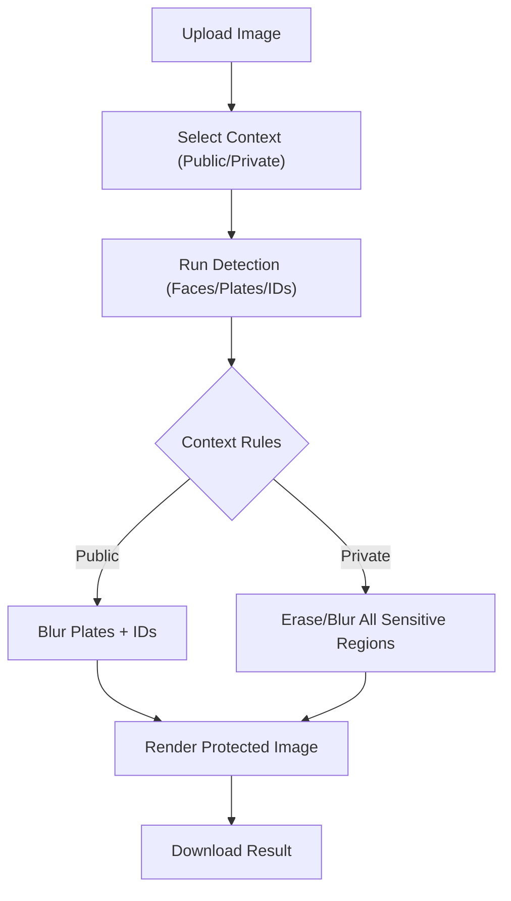

# 🛡️ Context-Aware AI Eraser

**Privacy-first image anonymization with a human-in-the-loop workflow.**  
Detect faces, license plates, and ID cards, then blur or erase based on your context.


---

## ✨ Highlights
- AI-assisted detection for **faces**, **license plates**, and **ID cards**
- **Context-aware anonymization** (Public vs Private) for flexible privacy control
- **Premium monochrome UI** with drag-and-drop upload and instant results
- **Local processing** with no cloud dependency

---

## 🧠 How It Works
1. Upload an image in the web UI.
2. Choose **Public** or **Private** context.
3. The pipeline detects sensitive regions.
4. Regions are blurred or erased based on context.
5. Download the protected image.

---

## 🗺️ Flowchart


---

## 🎯 Privacy Modes
- **Public**
  - Blur plates and IDs
  - Preserve faces for usability
- **Private**
  - Aggressive anonymization (erase/blur all sensitive regions)
  - Maximum privacy protection

---

## 🛠️ Tech Stack
- **Language:** Python 3.9+
- **Backend:** Flask
- **Frontend:** HTML5, CSS3, Vanilla JS
- **Computer Vision:** OpenCV
- **Object Detection:** YOLOv8 (Ultralytics)
- **Image Processing:** NumPy, Pillow

---

## 🚀 Quick Start
```bash
git clone https://github.com/vishva2410/context-aware-ai-eraser.git
cd context-aware-ai-eraser

python3 -m venv venv
source venv/bin/activate   # macOS/Linux
# venv\Scripts\activate    # Windows

pip install -r requirements.txt
```

### Run the app
```bash
python -m api.app
```

Open in browser:
```
http://127.0.0.1:5000
```

---

## ✅ Project Status
- Implemented: multi-object detection + context-aware anonymization
- Frontend: redesigned monochrome interface
- Backend: Flask API for uploads and processing

---

## 🧭 Future Goals
- Advanced scene understanding with ViT/CLIP for richer context
- Video processing pipeline with frame sampling + tracking
- User-controlled sensitivity sliders per object type
- Export presets for different sharing platforms
- Optional batch processing for folders

---

## 👤 Author
**Made by [Guduguntla Vishva Teja](https://github.com/vishva2410)**

---

## 📜 License
This project is licensed under the **MIT License**.
